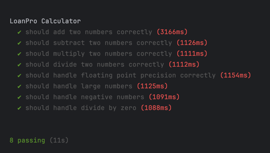

# CalculatorDocker
Automated Scripts for calculator using docker.

### Prerequisites

```
Node version >= 20
```

* Instructions for the calculator

The only requirement is to have Docker installed in your computer. It should work OK in macOS (apple silicon and intel) and Linux (x8664 and arm64). Windows is not supported.
First pull the image:

* docker pull public.ecr.aws/l4q9w4c5/loanpro-calculator-cli:latest


## Running the tests
Execute in terminal:
```
npm install
``` 

### Execution 
Execute in terminal:
``` 
npx mocha test.mjs
``` 

## Results example.
